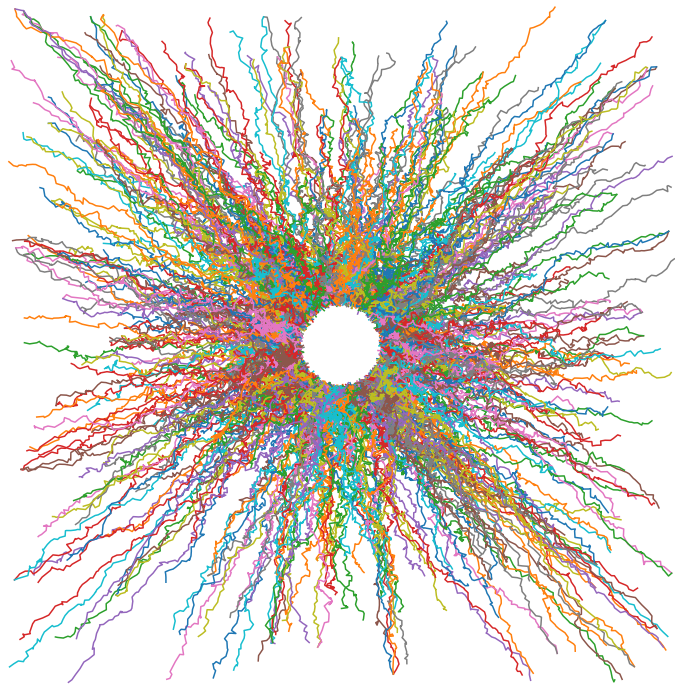

# Adapting the Function Approximation Architecture in Online Reinforcement Learning 

<p align="center">
  
</p>

Algorithms, RL environment and experiments were implemented by Fatima Davelouis and John Martin. This code is for reproducing the results from the paper and makes the Frog's Eye environment fully accessible for others to run experiments.

**Adapting the Function Approximation Architecture
in Online Reinforcement Learning,**<br />
*John D. Martin and Joseph Modayil (2021)* [[paper link](https://arxiv.org/pdf/2106.09776.pdf)].

The repository contains a minimal implementation of a shallow network architecture wired with prediction adapted neighborhoods.
Network output weights are learned with TD-Lambda (Sutton, 1988).
The repo also includes implementations of the Linear and Random baselines, an implementation of the Frog's Eye domain, and code for generating plots similar to Figure 4. 

## Getting Started
### Dependencies 
Before running the code, be sure to install the following dependencies. 

- python 3.6
- numpy
- scipy<br />
- jax
- gin
- argparse
- matplotlib
- traceback
- math
- functools<br />
- itertools
- multiprocessing

### Running an experiment
This code can be run locally or on Compute Canada.
The hyper-parameters used in [Martin and Modayil (2021)](https://arxiv.org/pdf/2106.09776.pdf) can be found in `config_relu_FrogsEye.gin`. 

#### Running an experiment locally
Run `python run_locally.py` on your home computer. 
You can choose to parallelize across configurations or not,
as specified by the `run_experiments.parallel_experiments` parameter in `config_relu_FrogsEye.gin`.


#### Running an experiment on Compute Canada
##### Generate experiment configurations
- run `generate_txt.py`. This will generate a txt file. Each line in the txt file is a specific experiment configuration.

##### Launch experiments
In order to run all configurations, we scheduled job arrays on the Beluga cluster in Compute Canada.
Take a look at `submit_experiments_FrogsEye_gpu_Beluga.sh`.<br />
You will need to replace your account name in the field `#SBATCH --account`.<br />

If you wish to run a specific configuration (for example, the configuration specified in line 5 of the `.txt` file), 
then you must change the last few lines in `submit_experiments_FrogsEye_gpu_Beluga.sh` to:
```shell
EXE=cat <txt file name> | head -n 5 | tail -n 1
command="python main_parser.py $EXE"
eval $command 
```


## How to plot results:
### Step 1: Specify architectures and hyper-parameters<br />
- Specify hyper-parameters in `plotting_config.gin`. 

### Step 2: Compute average binned squared return errors<br /> 
```commandline
python scripts/compute_stats.py
```
### Step 3: Compute data table that stores the final averaged return error across all hyper-parameters
```commandline
python scripts/generate_data_table.py
```

### Step 4: Generate and save sensitivity curves<br />
```commandline
python scripts/plot_sensitivity_curves_step_size.py
```

### Step 5: Generate and save learning curves<br />
```commandline
python scripts/plot_mean_squared_return_error.py
```
